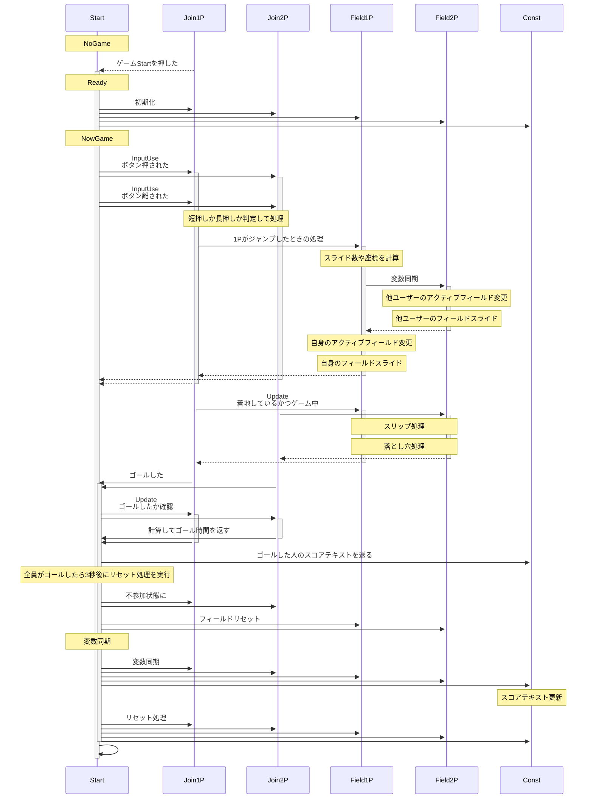

## シーケンス図

```mermaid
sequenceDiagram
	participant Start
  participant Join1 as Join1P
  participant Join2 as Join2P
  participant Field1 as Field1P
  participant Field2 as Field2P
  participant Const as Const
		Note over Start: NoGame
		Join1-->>+Start: ゲームStartを押した
		Note over Start: Ready
		Start->>+Join1: 初期化
		Start->>+Join2: 		
		Start->>+Field1:
		Start->>+Field2: 		
		Start->>+Const: 
		Note over Start: NowGame
		Start->>+ Join1: InputUse<br/>ボタン押された
		Start->>+ Join2: 
		Start->>Join1: InputUse<br/>ボタン離された
		Start->>Join2: 
		Note over Join1,Join2: 短押しか長押しか判定して処理
		Join1->>+Field1: 1Pがジャンプしたときの処理
		Note over Field1: スライド数や座標を計算
		Field1->>+Field2: 変数同期
		Note over Field2: 他ユーザーのアクティブフィールド変更
		Note over Field2: 他ユーザーのフィールドスライド
		Field2-->>-Field1:
		Note over Field1: 自身のアクティブフィールド変更
		Note over Field1: 自身のフィールドスライド
		Field1-->>-Join1:
		Join2-->>-Start: 
		Join1-->>-Start: 
		Join1->>+Field1: Update<br/>着地しているかつゲーム中
		Join2->>+Field2: 
		Note over Field1,Field2: スリップ処理
		Note over Field1,Field2: 落とし穴処理
		Field2-->>-Join2:
		Field1-->>-Join1:
		Join1->>+Start: ゴールした
		Join2->>Start:
		Start->>+Join1: Update<br/>ゴールしたか確認
		Start->>+Join2: 
		Join2->>-Start: 計算してゴール時間を返す
		Join1->>-Start: 
		Start->>+Const: ゴールした人のスコアテキストを送る
		Note over Start: 全員がゴールしたら3秒後にリセット処理を実行
		Start->>+Join1: 不参加状態に
		Start->>+Join2: 		
		Start->>+Field1: フィールドリセット
		Start->>+Field2: 
		Note over Start: 変数同期
		Start->>+Join1: 変数同期
		Start->>+Join2: 		
		Start->>+Field1:
		Start->>+Field2: 		
		Start->>+Const: 
		Note over Const: スコアテキスト更新
		Start->>Join1: リセット処理
		Start->>Join2:
		Start->>Field1:
		Start->>Field2: 		
		Start->>-Const: 
		Start->>-Start:		
```
